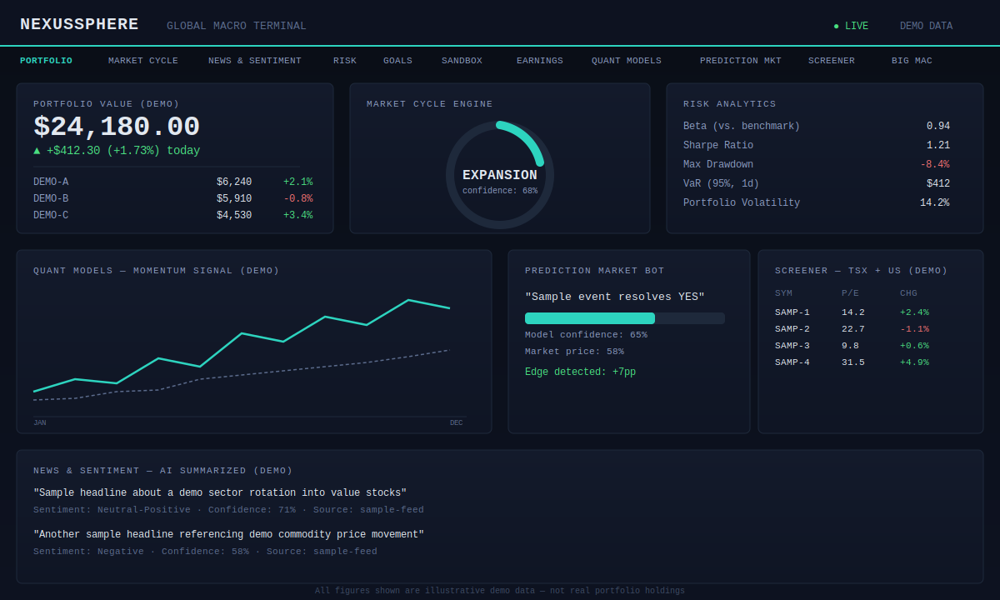
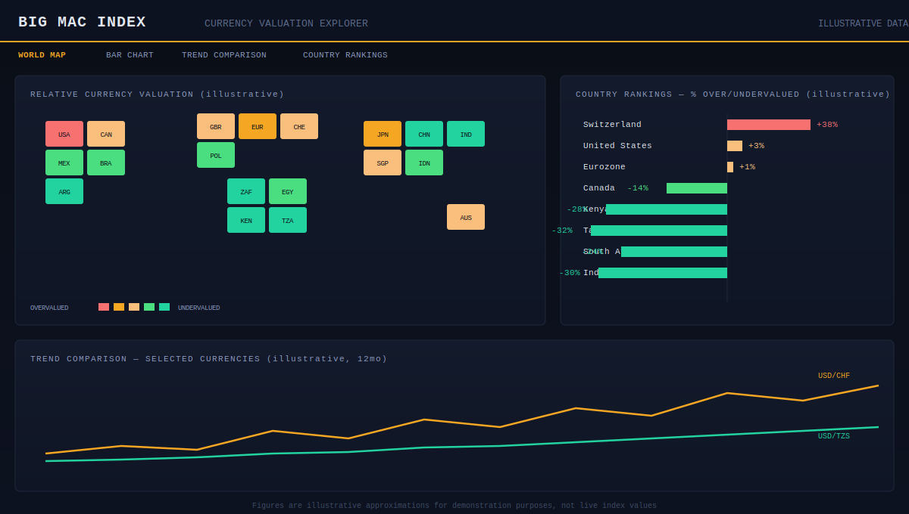

# NexusSphere — Global Macro Terminal

**A personal financial intelligence terminal: live portfolio tracking via real brokerage integration, a market cycle engine, quantitative models, a prediction-market bot, a TSX+US stock screener, and a standalone Big Mac Index currency explorer.**

[]()
[]()

> **Privacy note:** this repository previously had real personal portfolio data (actual holdings, cost basis, account balances) committed in its history. That data has been fully purged from every branch's history — verified via a full `git log --all` scan post-purge, zero remaining traces — and going forward `.gitignore` blocks the specific files that carried it. Everything shown below uses clearly labeled demo/illustrative data only.

---

## What this is

NexusSphere is a two-page Flask application that goes well beyond a typical portfolio tracker. The main terminal connects to a real brokerage (Wealthsimple, via the SnapTrade API) for live position data, then layers on genuinely sophisticated analysis: a market-cycle classification engine, quantitative momentum models, risk analytics (Sharpe ratio, VaR, drawdown), a prediction-market edge-detection bot, an earnings calendar, tax/performance tracking, and a Finviz-style stock screener covering both TSX and US markets. A second standalone page is a full currency-valuation explorer built around the Big Mac Index — world map view, bar charts, trend comparisons, and country rankings.

### Main Terminal



*Portfolio tracker, market cycle engine, risk analytics, quant models, prediction market bot, and stock screener — all data shown above is illustrative demo data, not real holdings.*

### Big Mac Index Currency Explorer



*Standalone currency-valuation tool (`/bigmac` route) — relative valuation map, country rankings, and trend comparisons. Figures are illustrative approximations for demonstration.*

---

## Core Features

- **Live portfolio tracking** — real brokerage connection via SnapTrade (Wealthsimple)
- **Market cycle engine** — classifies current macro regime (e.g., expansion/contraction) with a confidence score
- **Quantitative models** — momentum and signal-based analysis
- **Risk analytics** — beta, Sharpe ratio, max drawdown, Value-at-Risk, volatility
- **Prediction market bot** — compares model-derived probability against live market price to surface edge
- **Stock screener** — Finviz-style screening across TSX and US markets
- **News & sentiment** — AI-summarized headlines with sentiment scoring per symbol
- **Big Mac Index explorer** — standalone currency valuation tool with world map, rankings, and trend views
- **Tax/performance tracking, goals, sandbox, and earnings calendar** — supporting tools around the core terminal

---

## Tech Stack

| Layer | Technology |
|---|---|
| Backend | Flask (Python) |
| Frontend | Two self-contained HTML files with embedded CSS/JS (no separate frontend build) |
| Charts / visualization | Chart.js, D3.js, TopoJSON (for the world map) |
| Brokerage integration | SnapTrade API (Wealthsimple) |
| AI | Claude (`claude-sonnet-4-5`) and GPT-4o, via Replit's built-in AI integration — **no user-managed API keys required**, billed to Replit credits directly |

**Worth calling out:** the AI integration choice (Replit-managed, no user API keys) is a genuinely good security decision — it's part of why this repo had zero AI-provider credentials to leak in the first place, unlike several other repos in this portfolio.

---

## Getting Started (Local Dev)

### Prerequisites
- Python 3.11+
- A SnapTrade developer account (for live brokerage connection — optional, the app runs without it, just without live positions)

### Installation

```bash
git clone https://github.com/creova-gif/NexusSphere.git
cd NexusSphere
# dependency management via uv (see pyproject.toml / uv.lock)
uv sync
```

### Environment Variables

| Variable | Required | Notes |
|---|---|---|
| `SNAPTRADE_CLIENT_ID` | For live brokerage data | Correctly read via `os.environ.get()` — never hardcode this |
| `SNAPTRADE_CONSUMER_KEY` | For live brokerage data | Same — env var only |

### Running locally

```bash
python main.py
```
Serves on port 5000. Two routes: `/` (main terminal) and `/bigmac` (currency explorer).

---

## Security

A full credential history scan was run across every commit on every branch — **zero leaked credentials found**. The one real finding was personal financial data (not credentials) baked into static HTML snapshots and AI-prompt-dump text files under `attached_assets/`; that has been fully purged from history as noted above, and `.gitignore` now blocks those specific paths going forward.

## Contributing

This is a personal, proprietary project. External contributions are not accepted at this time.

## License

Proprietary — All Rights Reserved. See `LICENSE`.

## Credits

Built by Justin Mafie.
